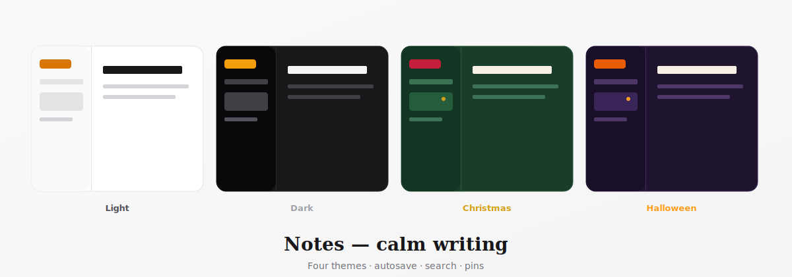
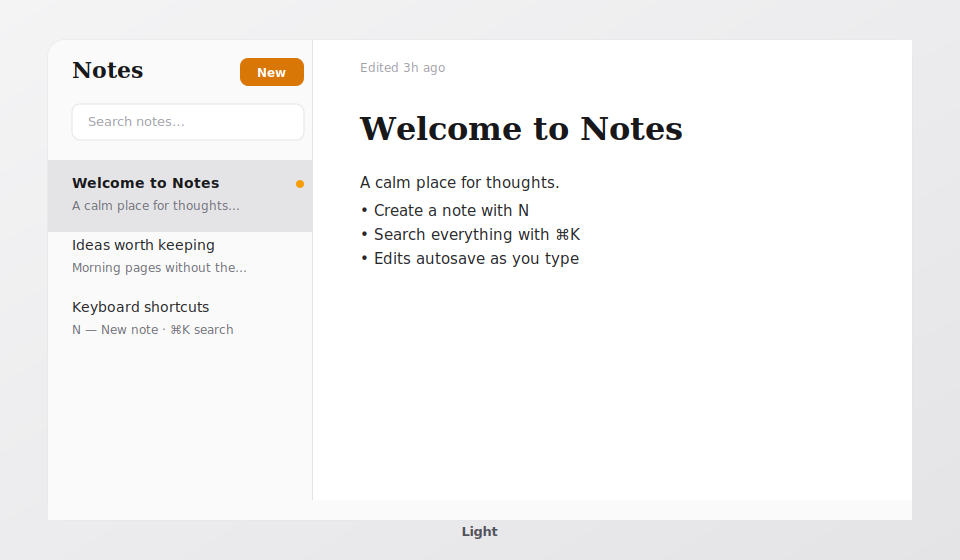
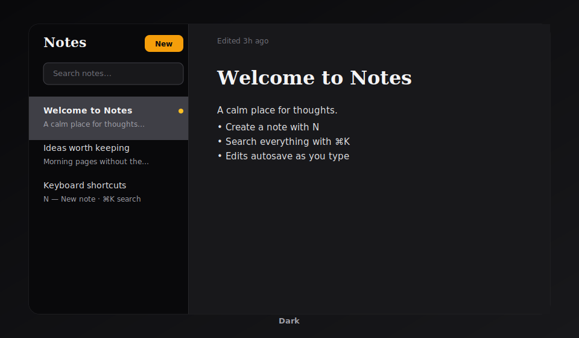
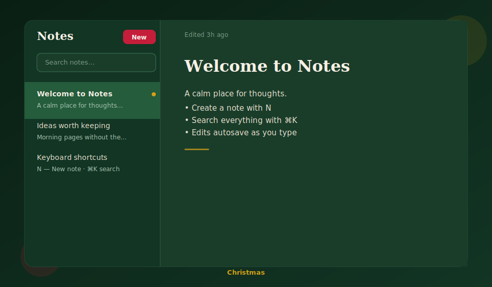
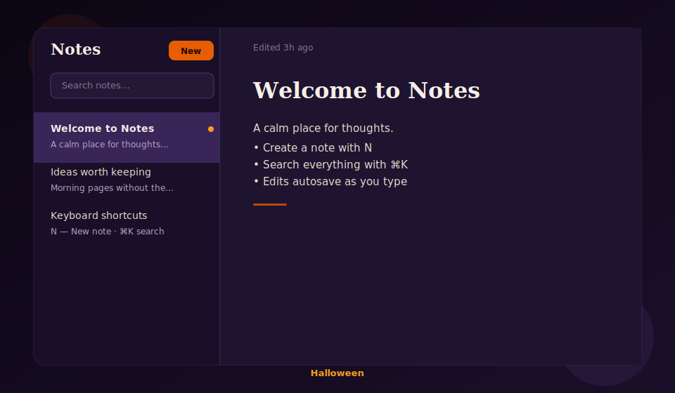

# Notes — calm writing



A polished note-taking app in the spirit of Linear and Things 3.

## Features

- Create, edit, delete notes (autosave)
- Search via sidebar filter or **⌘K / Ctrl+K** command palette
- **N** for a new note (when not typing)
- Pin notes to the top of the list
- Split list | editor layout on desktop
- Mobile: editor-first + drawer for the list (vaul)
- localStorage persistence via zustand
- **Themes** (palette menu): Light · Dark · Christmas · Halloween

## Themes

Open the **palette** icon in the notes list (or editor toolbar) to switch. Your choice is saved in `localStorage`.

### Light

Warm zinc, white editor, amber accent — the default.



### Dark

Quiet night writing with zinc-950 surfaces.



### Christmas

Pine green, cream text, crimson buttons, gold pins.



### Halloween

Midnight purple, pumpkin orange accents.



| Theme | Surfaces | Accent |
|-------|----------|--------|
| **Light** (default) | Warm zinc-50 / white | Amber |
| **Dark** | Zinc-950 / zinc-900 | Amber |
| **Christmas** | Pine green / forest editor | Crimson + gold pins |
| **Halloween** | Midnight purple | Pumpkin orange |

## Stack

React 19 · TypeScript · Vite · TanStack Start/Router · Tailwind v4 · zustand · cmdk · vaul · sonner · lucide

## Scripts

```bash
npm run dev        # 0.0.0.0:8080
npm run build
npm run typecheck
./startup.sh       # idempotent background start
```

## Design

Product UI: divide-y list rows, muted selected state, full-height editor, subtle autosave indicator. Seasonal themes use full semantic color tokens so every surface re-tints cleanly.

Preview assets: [`docs/themes/`](docs/themes/).
